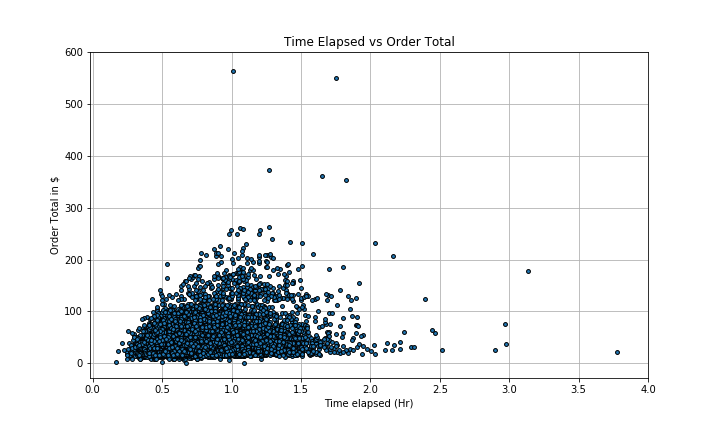
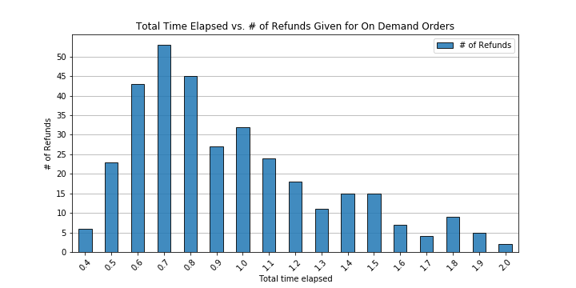
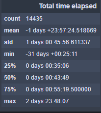
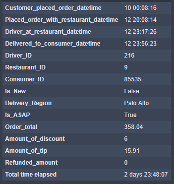

# Doordash-Analytics

This is a repository that holds the work I have done for the Take-Home assignment for DoorDash.

Here is a link to a short Tableau dashboard that I created to supplement my answer to the first part of the assignment:
https://public.tableau.com/profile/rafael.santa.cruz#!/vizhome/DoordashAnalyticsTake-Home/Dashboard1?publish=yes

In that dashboard, I was able to glean information about people who receive discounts and how much they tip. People who receive discounts are more prone to tip, and generally tend to tip a little higher as the discounts goes up. While the increase is not as high as one would have thought, I would propose a feature that could notify the customer who received a hefty discount to encourage them to tip a little bit higher. 
Another suggestion to the product will be to potentially have a feature that will shave off some of the customer's discount to allow for a higher tip. A caveat to this is that the discount must be high enough so that the customer still feels like they are receiving a good deal. 

A couple of upsides to this:
* The driver receives extra compensation. Extra compensation will increase retention rate of Dashers.
* Customer is already receiving a discount, so it is not a huge blow to their wallet.

 ---------------------
 
 I used Jupyter Notebook along with Pandas and Matplotlib to generate the plots below:
 I went ahead and took it a step further and calculated the difference in time from when the customer places their order to when they receive their food to uncover some insights on how customers spend. (Looking at On Demand orders only)

There seems to be a threshold for the amount of time it takes for a customer's order to arrive and how much the entire order cost, and it seems like the majority of orders here are less than $100. The outliers here in this graph are interesting and hard to decipher and I found that a limitation of the dataset was that there was no way of telling the type of order one placed, and that would be important in determining key metrics for more niche categories such as catering. 

In addition to that, geographical data will be immensely valuable to this dataset as machine learning algorithms can be trained to determine exact wait times for customers based on the traffic data that is available and based on the data that DoorDash could generate from app metadata. 
Creating stronger predictive analytics undoubtedly increases value and gives DoorDash a stronger reputation as being the leader in transparency and reliability when it comes to its logistics.

Using geographical data will help explain some outliers and also provide a means to generate a heatmap of where most of DoorDash's customers are spending the most, in turn, allowing for the creation of targeted marketing campaigns to drive customer satisfaction and boost sales.
 

 ---------------------

This graph below was interesting as it shows the amount of refunds processed against the time it took for the customer's order to arrive.
Assuming that the customer was dissatisfied with their wait time, this provides insight into how much customers are willing to wait before calling it quits on their order. 
This is interesting as there is a clear trend in the amount of refunds processed and the wait time. After about 40 minutes, most customers submit a request for a refund.

However, this graph does NOT take into account potential mistakes on the restaurants part. As we will see below, the median time for a delivery is about 43 minutes, so this does not fully explain why customers are requesting so many refunds if the wait time is usually the same as a typical order.

 ---------------------
 
Here is a quick summary of the time it takes for a customer to receive their order. As mentioned above, we see that the median time is 43 minutes. These facts are for On Demand orders. 
(NOTE: Due to the nature of the data, median is the best measurement for this case, and not the mean. Since datetimes in the dataset do not include months, Python will return negative datetimes with normalized minutes.)
We do see an extreme outlier of 2 days!

 ---------------------
Here we take a deeper dive into the outlier and notice a couple of things that could be improved on the backend. 
There is a clear indication that there was could have been a glitch in the system where the customer ordered ahead of time and it was flagged as "Is_ASAP" == True.
While this outlier was certainly omitted from my analyses and graphs, it may be worth checking out when the codebase is being reviewed to provide more accurate assessments of the data. 

